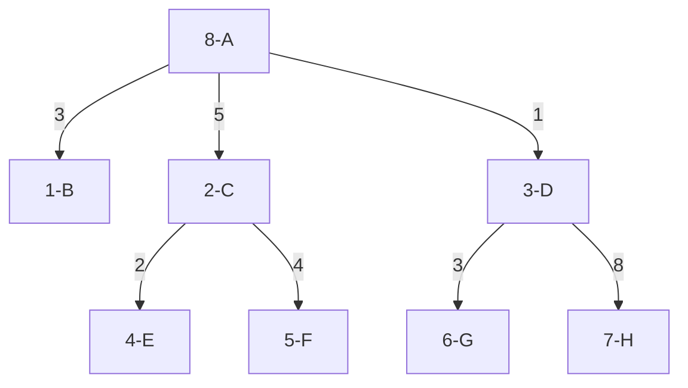

# Theory of Computation
> A simple material information management program.
## Table of contents
* [General Info](#general-information)
* [Technologies Used](#technologies-used)
* [Screenshots](#screenshots)
* [Room for Improvement](#room-for-improvement)
* [Setup](#setup)
* [Acknowledgements](#acknowledgements)

## General Information
Α program that will manage material information. Costs for the supply of raw materials will be calculated and the production of intermediates and
final products in order to satisfy some orders. he distinction of materials into categories follows the following rules:

- Raw materials
- Intermediate products[^1]
- Final products


The program reads an input file containing information about each type of material that assembles the final product. The file
will also have information on pending final product orders.


The input file is formatted as follows
````
```
<Materials count>
<Code> <Material Name> <Quantity> <Number of Ingredients> <Code1> <Quantity1>...
<Code> <Units requested>
```
````

The output file is formatted as follows

````
```
Number of material types: <Number>
<Code>/<Name> - <Units number> units in stock - <Units number> units needed.
```
````


## Screenshots


## Technologies Used
C Integrated Development Environment (IDE)

## Setup
Basic project for language learning. <br />
External text input with two parts
- The first part describes the types of materials 
- The second part the pending orders. 

Τhen we give an example of an input file. <br />
https://github.com/z1skgr/Managing-Materials/issues/1#issue-1140284274


## Acknowledgements
- This project was one of my very first project for learning C.
- This project was created for the requirements of the lesson Introduction to Computers.

[^1]: Intermediate products can be an intermediate composition.
